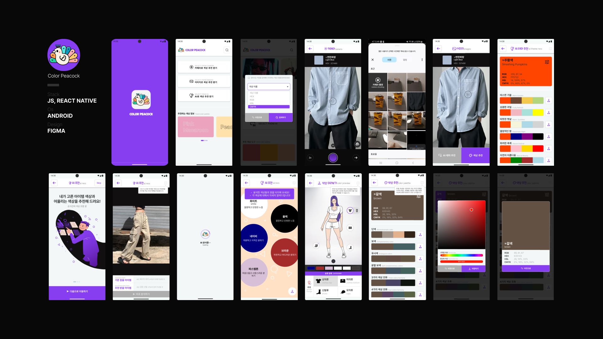
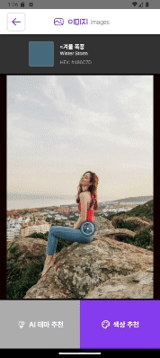
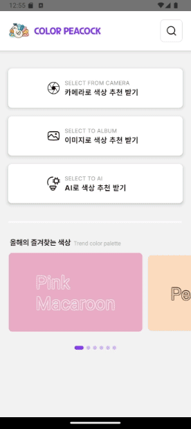
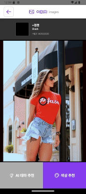
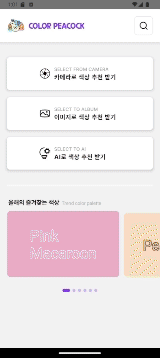

# [🦚 Color Peacock](https://play.google.com/store/apps/details?id=com.ColorPeacock&pcampaignid=web_share)
```
🤷🏻‍♀️ 무슨 색이 어울리는지 누군가 알려줬으면...
💁🏻‍♂️ 내게 정확한 색상을 알려줄 수 있을까?

💡 색상 추출 및 조합은 단순히 색상의 혼합에 그치지 않고, 환경과 상황에 맞는 최적의 색상 팔레트를 제공하여
  사용자에게 창의적이고 실용적인 디자인 솔루션을 제공하고자 합니다.

공작새의 깃털은 그 자체로 아름답고 화려하며, 다양한 색상과 패턴을 자랑합니다.
이는 공작새의 독특한 아름다움과 장식적인 요소를 상징합니다.
사용자가 색상 조합을 선택할 때, 공작새의 화려한 깃털처럼 아름답고 조화로운
색상 조합을 만들어 준다는 의미를 담고 있습니다.
```

## 📱 주요 기능


<table>
  <tr>
    <th>1. 홈 화면 - 검색 기능</th>
    <th>2. 색상 추천 화면</th>
    <th>3. 이미지 화면 - 색상 추천</th>
    <th>4. 이미지 화면 - AI 추천</th>
    <th>5. AI 추천 화면</th>
  </tr>
  <tr>
    <td></td>
    <td></td>
    <td></td>
    <td></td>
    <td></td>
  </tr>
</table>


## 🛠️ 기술 스택
- language : javascript → typescript
- react framework : react native

## 🧑🏻‍💻 팀원

|  |  |  |  |  |
|:---------------------------------------:|:---------------------------------------:|:---------------------------------------:|:---------------------------------------:|:-----------------------------------------------:|
| [**김태현**](https://github.com/xogus7)                              | [**윤경민**](https://github.com/Nymphe11)                              | [**이도성** ](https://github.com/doseong98)                              |[ **이성우** ](https://github.com/Lsw96)                              | [**임성민**](https://github.com/sungminstar)                                   |
| 주 개발 프로젝트 관리<br>홈 화면 담당<br>검색, 캐러셀 기능 구현 | 주 기획<br>AI 적용 및 프롬프트 구상<br>색상 조합 공식 제작 | 카메라 추출 화면 담당<br>오브젝트 화면 담당 | 주 기획<br>주 디자인<br>스플래시 기능 구현 | 주 개발 프로젝트 관리<br>이미지, AI 화면 담당<br>색상 추천 화면 담당           |

## 🗓️ 개발 기간
2024.08.01 ~ 2024.09.13
---
#### [🦚 Color Peacock 앱 다운로드 바로가기](https://play.google.com/store/apps/details?id=com.ColorPeacock&pcampaignid=web_share)
#### [🎨 Color Peacock 피그마 바로가기](https://www.figma.com/design/u6HEGpu8iK2bha0M8aFPv1/%EC%BC%A0%EA%B9%80%EC%97%90-%EB%B0%B0%ED%8F%AC%EA%B9%8C%EC%A7%80?node-id=490-6365&t=wppappiwY8TNsVZq-1)

